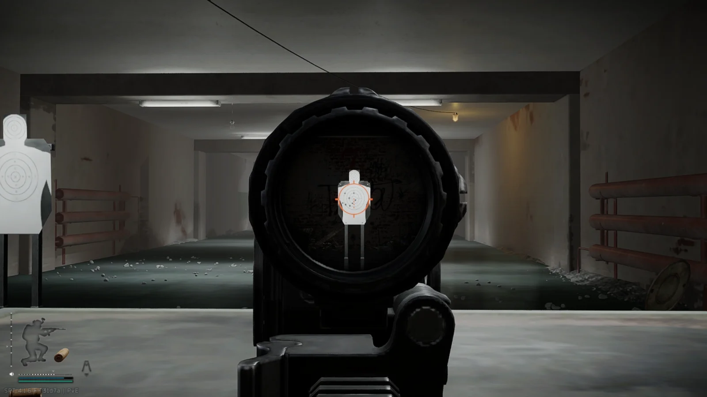
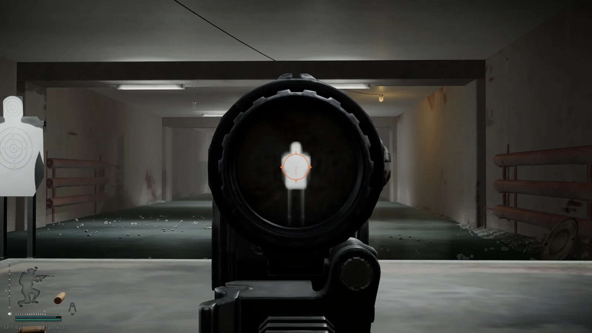

%%%%%%%%%%%%%%%%%%%%%%%%%%%%%%%%%%%%%%%%%%%%%%%%%%%%%%%%%%%%%%%

# PerformanceScope

> 调整《Single Player Tushonka》光学瞄具**镜内放大（PiP）相机**渲染分辨率的 SPT 客户端插件。

镜内画中画（PiP）是原生瞄具最吃 GPU 的部分：游戏会为瞄具单独创建一台相机，把一张 `N×N` 的方形 RenderTexture（默认 `1024²`）贴到镜片上。本插件让这个 `N` 可配置，从而在画质与帧数之间自行取舍。

## 效果

同一靶场、同一瞄具，仅改变镜内分辨率，镜片外的画面保持一致：

| 绝对像素 2048 | 绝对像素 256 | 绝对像素 64 |
| --- | --- | --- |
|  |  |  |
| 镜内清晰，开销最大 | 折中 | 明显变糊，开销最小 |

## 性能

- **单次触发**：
  模组不做任何每帧轮询，常驻开销为零。只在调整数值的瞬间触发一次镜内 RenderTexture 重建，可能有一帧卡顿；
  有 250 ms 防抖，所以拖动滑块也只重建一次。
- **收益取决于瓶颈**：镜内画中画相当于“第二台相机把场景再渲染一遍”。
  降低镜内分辨率能降低 GPU 填充和带宽需求，**在 GPU 瓶颈时对帧数提升显著**；
  若受限于 CPU，或镜外画面已占满 GPU，收益会明显变小。

## 安装

1. 下载 Releases 中的 `PerformanceScope-v{版本}.zip`。
2. 解压到游戏根目录，使 dll 位于
   `BepInEx/plugins/PerformanceScope/PerformanceScope.dll`。
3. 启动游戏。

## 快速上手

1. 确认已安装 [BepInEx ConfigurationManager](https://github.com/BepInEx/BepInEx.ConfigurationManager)。
2. 游戏内按 **F12**（SPT 默认；上游 BepInEx ConfigurationManager 默认 F1，可在其配置中改键）打开菜单，找到 `PerformanceScope` 分区。
3. 把“取值方式 | Resolution Mode”设为“屏幕高度比例”或“绝对像素”——
   默认是“游戏默认”，安装后不改变游戏行为。
4. 进战局举镜查看效果；开启“启用日志”后可在
   `BepInEx/LogOutput.log` 看到 `镜内分辨率 1024 → …`。

> 注意：`屏幕高度比例` 在 4K（2160p）下取 `0.7` 会得到 1512，**高于**默认 1024，反而更吃性能。

## 文档

- [原理与逆向细节](docs/principle.md)
- [配置参考](docs/configuration.md)
- [构建、测试与发布](docs/development.md)
- [实机验证](docs/verification.md)
- [兼容性与限制](docs/compatibility.md)

## 支持版本

SPT `4.1.x`（EFT 客户端 `0.16`）。

## 许可证

[MIT](LICENSE)

===============================================================

# PerformanceScope

> An SPT client plugin that adjusts the render resolution of the **in-scope (PiP) camera** for magnified optics in Single Player Tushonka.

Picture-in-picture (PiP) is the most GPU-hungry part of a magnified optic: the game creates a dedicated camera and renders an `N×N` square RenderTexture (default `1024²`) onto the lens. This plugin makes that `N` configurable, so you can trade image quality for frame rate.

## Effect

Same range, same optic; only the in-scope resolution changes, while the exterior stays identical:

| Absolute pixels 2048 | Absolute pixels 256 | Absolute pixels 64 |
| --- | --- | --- |
|  |  |  |
| Sharpest in-scope image, highest cost | Balanced | Clearly blurry, lowest cost |

## Performance

- **Single-shot**:
  the plugin does no per-frame polling, so its steady-state cost is zero.
  Only the moment you change a value triggers one in-scope RenderTexture rebuild, which may cost a frame of stutter; config changes are debounced by 250 ms, so dragging a slider still rebuilds only once.
- **The gain depends on the bottleneck**:
  the in-scope picture is a second camera rendering the scene again.
  Lowering the in-scope resolution reduces GPU fill and bandwidth, so the frame-rate gain is **significant when the GPU is the bottleneck**.
  If you are limited by the CPU or the exterior already saturates the GPU, the gain is much smaller.

## Installation

1. Download `PerformanceScope-v{version}.zip` from Releases.
2. Extract it into the game root so the dll lands at
   `BepInEx/plugins/PerformanceScope/PerformanceScope.dll`.
3. Launch the game.

## Quick start

1. Make sure [BepInEx ConfigurationManager](https://github.com/BepInEx/BepInEx.ConfigurationManager) is installed.
2. Press **F12** in game (the SPT default; upstream BepInEx ConfigurationManager defaults to F1, rebindable in its config) and find the `PerformanceScope` sections.
3. Set "取值方式 | Resolution Mode" to "屏幕高度比例" (screen-height ratio) or "绝对像素" (absolute pixels) — the default is "游戏默认" (game default), which changes nothing.
4. Enter a raid and aim down sights to see the effect; enable "启用日志 | Enable Logging" to watch `镜内分辨率 1024 → …` in `BepInEx/LogOutput.log`.

> Note: with `屏幕高度比例` (screen-height ratio), a value of `0.7` on 4K (2160p) yields 1512, **higher** than the default 1024 and therefore more expensive.

## Documentation

- [How it works & reversing notes](docs/principle.md)
- [Configuration reference](docs/configuration.md)
- [Build, test & release](docs/development.md)
- [In-game verification](docs/verification.md)
- [Compatibility & limitations](docs/compatibility.md)

## Supported versions

SPT `4.1.x` (EFT client `0.16`).

## License

[MIT](LICENSE)

%%%%%%%%%%%%%%%%%%%%%%%%%%%%%%%%%%%%%%%%%%%%%%%%%%%%%%%%%%%%%%%
